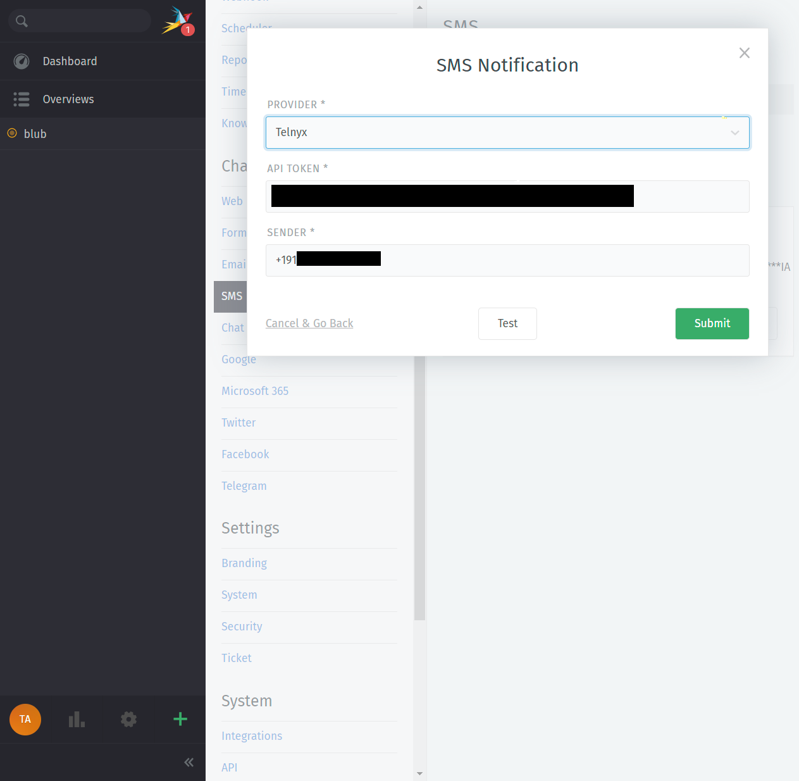

# Rolfs-Telnyx

This package contains the functionality to add SMS notification support for Telnyx provider.

I came up with that feature while creating an tutorial series for the zammad packages:

https://community.zammad.org/t/packages-tutorial/12079

# How to install the package

1. Click in your admin interface to the area (Admin -> Packages).

2. Download the current version for the package which is compatible to your zammad version:

3. Install the package.

4. Run all displayed commands in the UI on your shell and restart your zammad service.

# LICENSE

MIT
